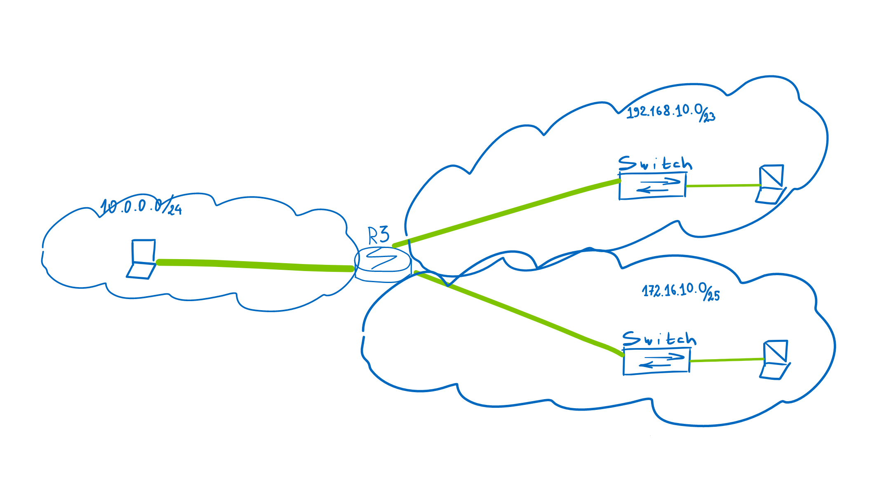

Задача 1.

Выполнить ручной расчет IP адреса сети, маски, Hostmin, Hostmax вручную для следующих значений. Затем проверьте себя на IP калькуляторе. 192.168.50.107/27 10.0.0.2/30 77.28.46.77/31 5.144.135.2/9

Задача 2.

 - рисунок схемы
